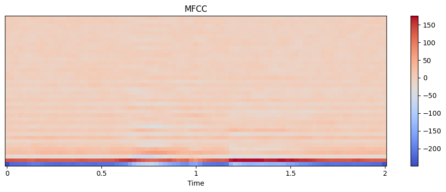
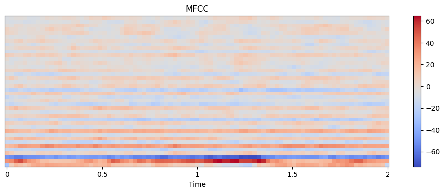
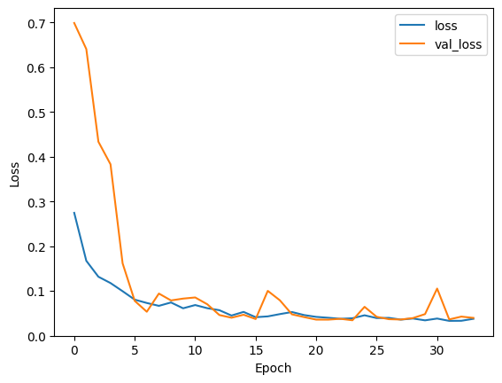
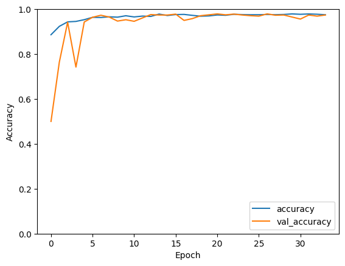
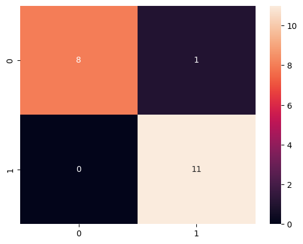

# Wake-Word-Detection

- [Wake-Word-Detection](#wake-word-detection)
  - [Introduction](#introduction)
  - [Data Collection](#data-collection)
  - [Data Preprocessing](#data-preprocessing)
  - [Model](#model)
  - [Results](#results)
  - [Contributors](#contributors)

## Introduction

in this notebook we are about to design a voice classifier, which will classify voice based on the fact that it can detect a specific word (or combination of words) in it or not.

## Data Collection

for data, we gathered 100 voices for each of classes: wake word and not wake word. you can use the functions in the notebook to gather your own voices, or you can use other data available on the internet, but be sure to do the preprocessing in the notebook, so they would all have the same length and format.

## Data Preprocessing

there are many steps for preprocessing voice data, in our experiment we will use the following steps:

1. **Feature extraction:** we extracted the MFCC features from the voice.
2. **normalization:** we normalized the features by subtracting the mean and dividing by the standard deviation.
3. **Data augmentation:** we augmented the data by adding noise, shifting, stretching, and pitch.

a sample extracted MFCC features from the voice:

- wake word sample


- not wake word sample


## Model

we used a **Convolutional Neural Network** (CNN) model for our experiment. we used a **Convolutional 1D**, **Batch Normalization**, **MaxPooling 1D** to extract features and then used a simple fully connected neural network to classify the voice.

the summary of model architecture is shown below:

```text
Model: "sequential_1"
_________________________________________________________________
 Layer (type)                Output Shape              Param #   
=================================================================
 conv1d_2 (Conv1D)           (None, 36, 32)            192       
                                                                 
 batch_normalization_2 (Batc  (None, 36, 32)           128       
 hNormalization)                                                 
                                                                 
 max_pooling1d_2 (MaxPooling  (None, 18, 32)           0         
 1D)                                                             
                                                                 
 dropout_3 (Dropout)         (None, 18, 32)            0         
                                                                 
 conv1d_3 (Conv1D)           (None, 14, 64)            10304     
                                                                 
 batch_normalization_3 (Batc  (None, 14, 64)           256       
 hNormalization)                                                 
                                                                 
 max_pooling1d_3 (MaxPooling  (None, 7, 64)            0         
 1D)                                                             
                                                                 
 dropout_4 (Dropout)         (None, 7, 64)             0         
                                                                 
 flatten_1 (Flatten)         (None, 448)               0         
                                                                 
 dense_2 (Dense)             (None, 128)               57472     
                                                                 
 dropout_5 (Dropout)         (None, 128)               0         
                                                                 
 dense_3 (Dense)             (None, 2)                 258       
                                                                 
=================================================================
Total params: 68,610
Trainable params: 68,418
Non-trainable params: 192
_________________________________________________________________
```

## Results

the results of our experiment are shown below:




Test Loss:  0.03955698758363724
Test Accuracy:  0.9739999771118164



as can be seen from the confusion matrix, the model is very accurate. this type of models can be used in voice-assistant applications especially those who are word-triggered, things like `Bixby` or `Alexa`.

## Contributors

- [Matin Bazrafshan](https://github.com/FabulousMatin)
- [Shahriar Attar](https://github.com/Shahriar-0)
